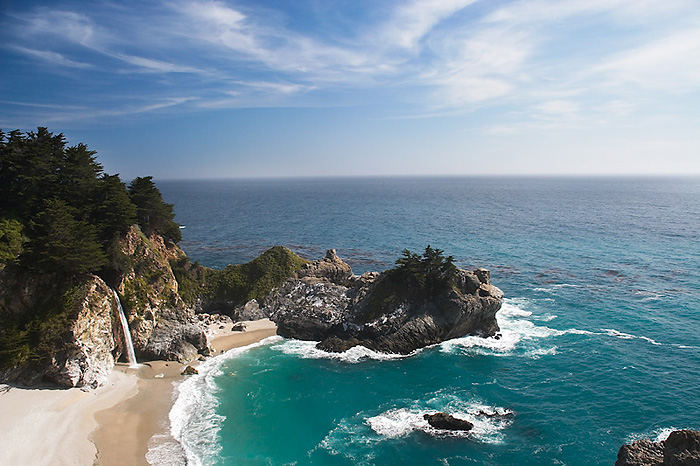
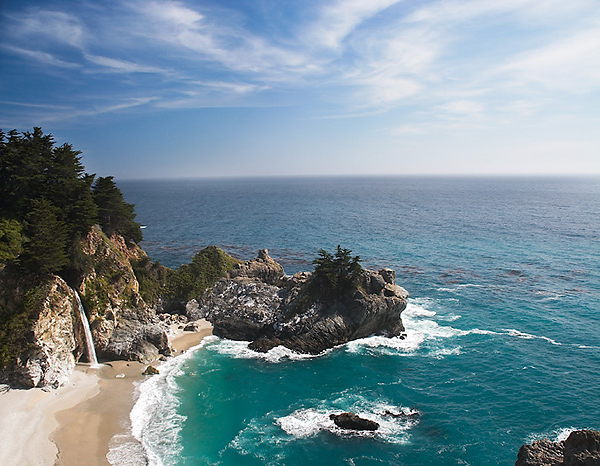

# Image Carving
The goal of this project is shrinking the image while preserving the integrity of critical image information.

First, compute energy map by:

Second, or each pixel, calculate cumulative minimum energy .

&space;=&space;E(i,j)&space;&plus;&space;min&space;\left&space;\{&space;M_x(i-1,j-1),&space;M_x(i-1,j),&space;M_x(i-1,j&plus;1)&space;\right&space;\})

Last, the end of the minimal connected vertical seam resides right at the minimum value of the last row in . And then, backtrack all the way up from this minimum entry on  to the first row in  to find the path of the optimal seam.

<i>Original Image</i>

 

<i>Intermediate Images</i>

 

<i>Shrinked Image</i>

