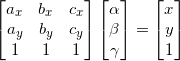
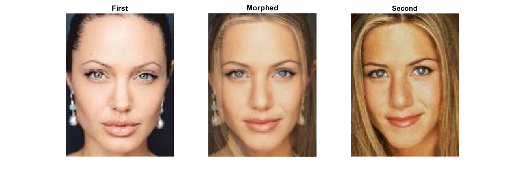
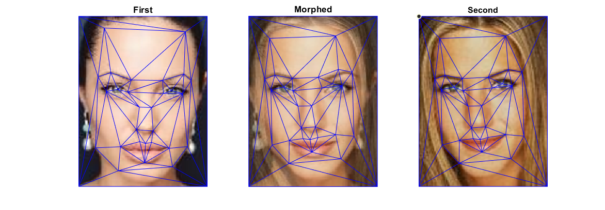

# Image Morphing via triangulation
A morph is a warp of the image shape and a cross-dissolve of the image colors. The warp is controlled by defining a correspondence between the two pictures. The correspondence maps eyes to eyes, mouth to mouth, chin to chin, ears to ears, etc., to get the smoothest transformation.

First, for each pixel in the intermediate image, determine which triangle it falls inside.

Second, compute the barycentric coordinate for each pixel in the corresponding triangle.

, where *a*,*b*,*c* are the three corners of triangle, *x*,*y* the pixel position,  are its barycentric coordinates.

Third, compute the cooresponding pixel position in the source image, using the barycentric equation.

Last, copy the pixel value from source images to intermediate image.

## Result

