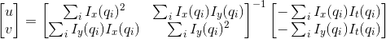

# Multiscale Optical Flow Estimation: Lucas-Kanade Method
Optical flow is defined as the pattern of apparent motion of image objects between two consecutive frames caused by the movement of object or camera. It can be presented as a 2D vector field where each vector is a displacement vector describing the motion of pixels from the first frame to the second.

## Optical Flow Estimation
Consider a image ), it takes dt time to move to (dx,dy). Since for those pixel value do not change. So that, =I(x&plus;dx,y&plus;dy,t&plus;dt))

Apply taylor expansion on the right-hand side

=I(x,y,t)&plus;\frac{\partial&space;I}{\partial&space;x}dx&plus;\frac{\partial&space;I}{\partial&space;y}dy&plus;\frac{\partial&space;I}{\partial&space;t}dt&plus;O(n^2))

Therefore, 

Divide both side by ,

or, 

## Lucas-Kanade Method
The Lucas–Kanade method assumes that the displacement of these two frames is small. And the image flow (u,v) must satisfy

where  are pixels.

Thus, the system has more equations than unknowns. The Lucas–Kanade method applies least square to get a compromise solution.

## Result

