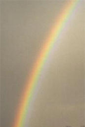
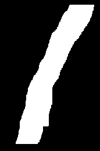
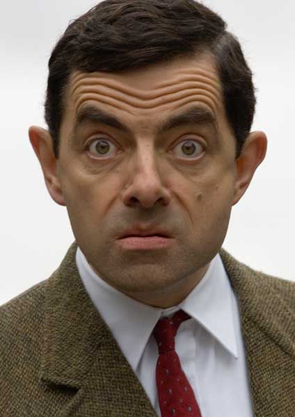
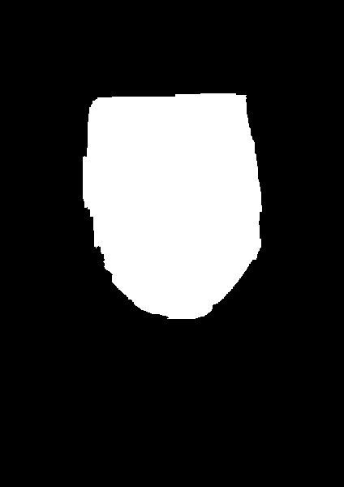
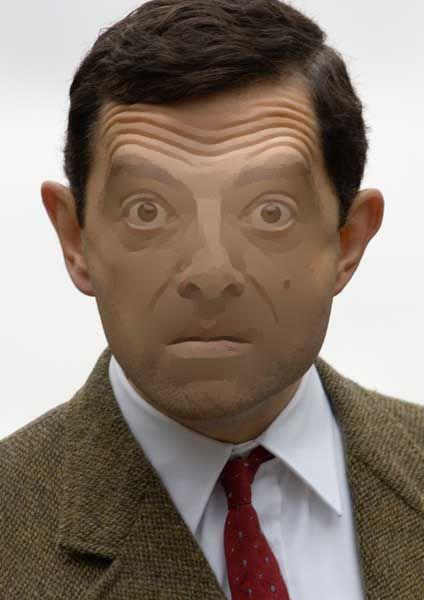

# Poisson Image Editing
The goal is seamlessly blend two images together automatically given the blending region.

## Image Blending

<i>Source Image</i>

  
  

 

<i>Target Image</i>

 

<i>Result</i>

## Image Flattening

<i>Source Image</i>

  
  

 

<i>Result</i>

## References
"Poisson Image Editing", Perez, P., Gangnet, M., Blake, A. SIGGRAPH 2003 https://www.cs.virginia.edu/~connelly/class/2014/comp_photo/proj2/poisson.pdf
